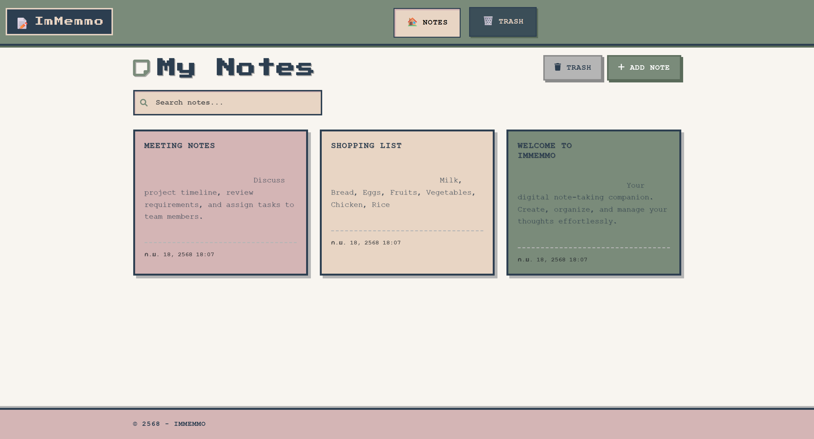
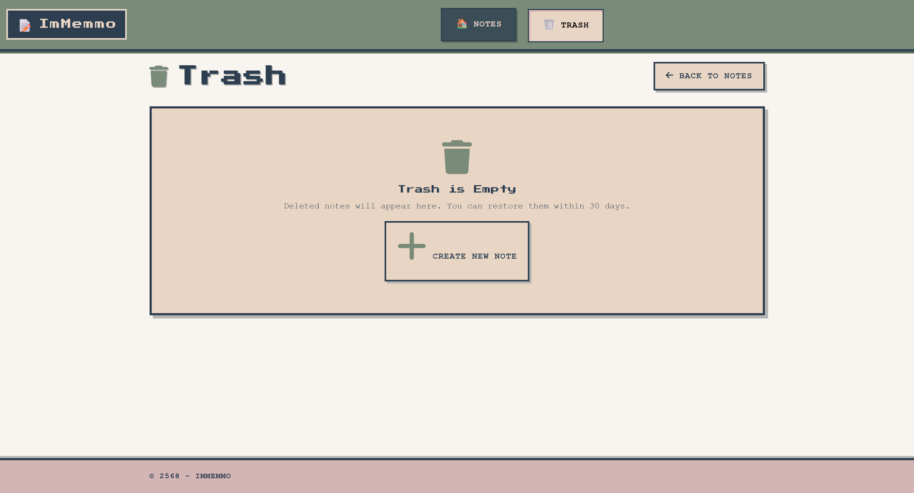
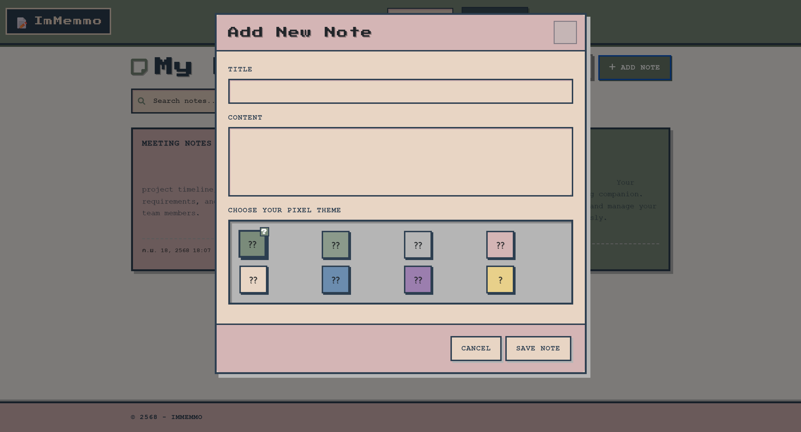
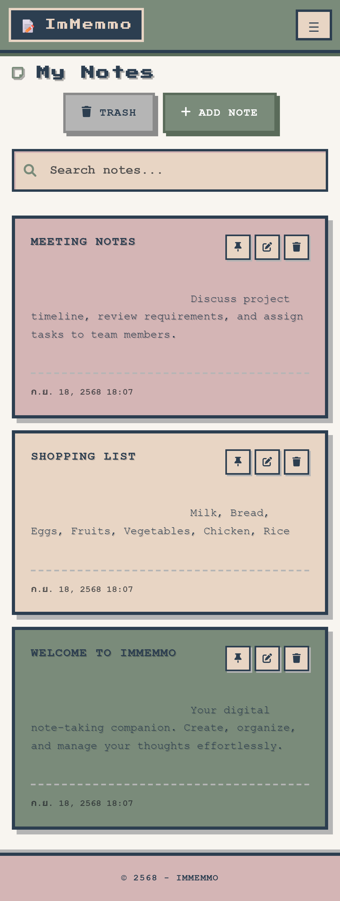

# 📝 ImMemmo

ImMemmo คือเว็ปแอปพลิเคชันเว็บสำหรับจดบันทึก สร้างขึ้นเพื่อทดลองและฝึกฝนการเขียนโปรแกรมด้วย ASP.NET โดยเน้นการใช้งาน Local Storage ของเบราว์เซอร์ 🎯  
ผู้ใช้สามารถสร้าง จัดการ และจัดระเบียบโน้ตได้อย่างสะดวก โดยไม่ต้องพึ่งฐานข้อมูล ดีไซน์ได้รับแรงบันดาลใจจากเกม 🎮 ใช้งานง่ายและสนุก

---

## ✨ คุณสมบัติ (Features)

- 🆕 **สร้าง แก้ไข และลบโน้ต**: เพิ่ม แก้ไข หรือลบโน้ตได้อย่างง่ายดาย
- 💾 **เก็บข้อมูลใน Local Storage**: ข้อมูลโน้ตจะถูกบันทึกไว้ในเบราว์เซอร์ของคุณ ไม่ต้องเชื่อมต่อเซิร์ฟเวอร์หรือฐานข้อมูล
- 🗂️ **จัดระเบียบโน้ต**: แยกหมวดหมู่หรือจัดกลุ่มโน้ต ให้ค้นหาง่ายขึ้น
- 🎮 **ดีไซน์สไตล์เกม**: อินเทอร์เฟซที่ได้รับแรงบันดาลใจจากเกม ทำให้การใช้งานสนุก
- 📱 **รองรับหลายอุปกรณ์**: ใช้งานได้ทั้งบน PC และมือถือ

---

## 🛠️ เทคโนโลยีที่ใช้ (Tech Stack)

-  **ASP.NET (C#)**
-  **HTML**
-  **CSS**
-  **JavaScript**

---

## 🚀 วิธีเริ่มต้นใช้งาน (Getting Started)

1. **Clone Repository**
   ```bash
   git clone https://github.com/etsuwithtea/ImMemmo.git
   ```

2. **เปิดโปรเจคใน Visual Studio**
   - เปิดไฟล์ `.sln` หรือไฟล์โปรเจค ASP.NET ใน Visual Studio
   - Build และ Run โปรเจค

3. **เข้าถึงแอปผ่านเบราว์เซอร์**  
   - เมื่อรันสำเร็จ ให้เปิดเบราว์เซอร์ไปที่ `http://localhost:xxxx`  
   - เริ่มจดบันทึกได้เลย! 📝✨

---

## 🖼️ ตัวอย่างหน้าจอ (Screenshots)






---

## 🎯 จุดประสงค์ของโปรเจค (Project Purpose)

โปรเจคนี้สร้างขึ้นเพื่อฝึกฝนและทดลองใช้เทคโนโลยี ASP.NET, การจัดการ Local Storage ฝั่ง Frontend ตลอดจนออกแบบ UX/UI แนวเกม  
เหมาะสำหรับใช้เป็นต้นแบบ (template) หรือศึกษาแนวทางการพัฒนาเว็บแอปพลิเคชัน

---

## 📄 License

Distributed under the [MIT License](LICENSE).

---

> ✍️ **ขอให้สนุกกับการจดบันทึก! (Happy note-taking!)** 🎉
